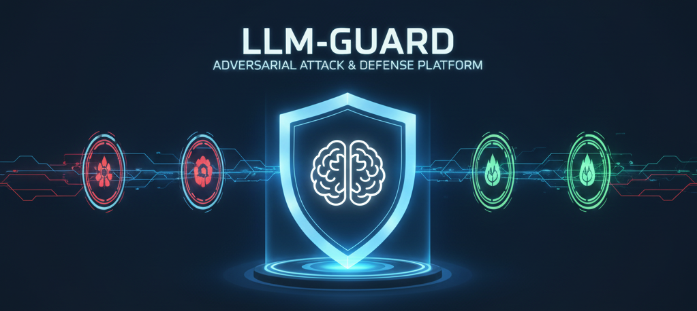

# 🛡️ LLM-Guard: Adversarial Prompt Injection & Defense Platform



> **A systematic framework for simulating, detecting, and mitigating prompt injection and jailbreak attacks on Large Language Models.**


---

## 🏫 Project & Academic Details

**Institution:** [KR Mangalam University](https://www.krmangalam.edu.in/)  
**Course:** BCA (AI & Data Science)  
**Semester:** 4  
**Year Coordinator:** Dr. Reenu  


### 👥 The Team

| Name | Roll Number | Role |
| :--- | :--- | :--- |
| **Aditya Shibu** | 2401201047 | **Team Leader** / Backend Architect |
| **Lakshya Dangwal** | 2401201030 | Attack Simulation / Red Teaming |
| **Akash Sharma** | 2401201108 | Defense Logic / Blue Teaming |
| **Bhavya Rattan** | 2401201004 | Frontend & Visualization |

---

## 📖 Project Overview

As Large Language Models (LLMs) like GPT-4 and Llama-3 become integral to software, they introduce critical security vulnerabilities. **Prompt Injection** and **Jailbreaking** allow malicious users to manipulate LLM outputs, bypass safety filters, and leak sensitive data.

**LLM-Guard** is a research-driven platform designed to:
1.  **Demonstrate** vulnerabilities in standard LLM deployments.
2.  **Simulate** real-world attacks (DAN, Roleplay, Obfuscation).
3.  **Implement** layered defense mechanisms (Sanitization, Vector Analysis).
4.  **Evaluate** security performance using quantitative metrics.

---

## ⚙️ System Architecture


The system follows a pipeline approach:
1.  **Attack Vector:** User input or automated attack scripts.
2.  **Defense Layer 1 (Input):** Regex sanitization & heuristic scanning.
3.  **LLM Inference:** Local processing via Ollama (Mistral/Llama3).
4.  **Defense Layer 2 (Output):** Response audit for keyword leakage.
5.  **Analytics:** Logging success/failure rates to the dashboard.

---

## 🚀 Key Features

### 🔴 Red Team (Attack Engine)
* **Direct Injection:** Overriding system prompts to force unintended behaviors.
* **Jailbreak Library:** Automated testing of known jailbreaks (e.g., DAN, Mongo Tom).
* **RAG Poisoning:** Simulating indirect injections via compromised document retrieval.

### 🔵 Blue Team (Defense Layer)
* **Context Isolation:** Separating user data from system instructions.
* **Input Filtering:** Detecting aggressive or manipulative patterns before inference.
* **PII Redaction:** Automatically masking sensitive data in outputs.

### 📊 Analytics Dashboard
* Real-time toggle for **Defense ON/OFF**.
* Visual metrics comparing attack success rates.
* Live chat log with security flagging.

---

## 🛠️ Technology Stack

* **Core Logic:** Python 3.10
* **API Framework:** FastAPI + Uvicorn
* **Model Runtime:** Ollama (Local Inference)
* **LLMs Used:** Mistral-7B, LLaMA-3
* **Vector Database:** FAISS (for RAG experiments)
* **Frontend:** React.js + Tailwind CSS
* **Tools:** Postman, Git, VS Code

---

## ⚡ Installation & Setup

### Prerequisites
* Python 3.10+
* Node.js (for Frontend)
* [Ollama](https://ollama.com/) installed and running.

### 1. Backend Setup
```bash
# Clone the repository
git clone [https://github.com/your-username/llm-guard.git](https://github.com/your-username/llm-guard.git)
cd llm-guard/backend

# Create virtual env
python -m venv venv
source venv/bin/activate  # or venv\Scripts\activate on Windows

# Install dependencies
pip install -r requirements.txt

# Run the API
uvicorn app.main:app --reload