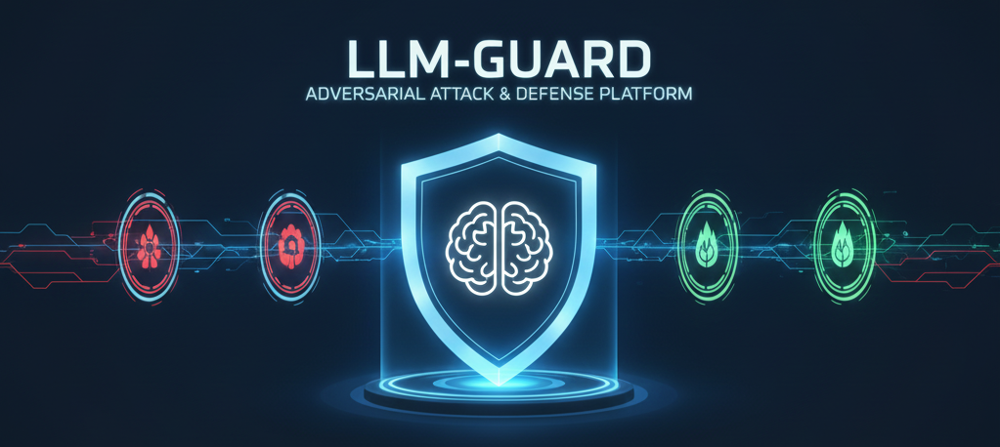

# 🛡️ NEURO-SENTRY DEFENSE SYSTEM
## Complete Full-Stack LLM Security Platform



> **A systematic framework for simulating, detecting, and mitigating prompt injection and jailbreak attacks on Large Language Models.**


---

## 🏫 Project & Academic Details

**Institution:** [KR Mangalam University](https://www.krmangalam.edu.in/)  
**Course:** BCA (AI & Data Science)  
**Semester:** 4  
**Internal Coordinator:** Dr. Ravinder Beniwal  
**Email:** ravinder.beniwal@krmangalam.edu.in  


---

### 👥 The Team

| Name | Roll Number | Role |
| :--- | :--- | :--- |
| **Aditya Shibu** | 2401201047 | **Team Leader** / Backend Architect / Attack Simulation / Red Teaming |
| **Akash Sharma** | 2401201108 | Defense Logic / Blue Teaming |
| **Bhavya Rattan, Lakshya Dangwal** | 2401201004 | Frontend & Visualization |

---

## 📖 Project Overview

As Large Language Models (LLMs) like GPT-4 and Llama-3 become integral to software, they introduce critical security vulnerabilities. **Prompt Injection** and **Jailbreaking** allow malicious users to manipulate LLM outputs, bypass safety filters, and leak sensitive data.

**NEURO-SENTRY DEFENSE SYSTEM** is a complete full-stack production platform designed to:
1. **Demonstrate** vulnerabilities in standard LLM deployments
2. **Simulate** real-world attacks (DAN, Roleplay, Obfuscation, Encoding)
3. **Implement** a layered 4-stage hybrid detection pipeline
4. **Evaluate** security performance using quantitative metrics
5. **Provide** batch red-team testing with exportable reports

---

## ⚙️ System Architecture

```
┌─────────────────────────────────────────────────────────────────┐
│                    Frontend (React + Vite)                      │
│  ┌──────────┐ ┌──────────┐ ┌──────────┐ ┌──────────┐ ┌──────┐ │
│  │ Command  │ │ Attack   │ │ Neural   │ │ Security │ │ Red  │ │
│  │ Center   │ │ Lab      │ │ Link     │ │ Ops      │ │ Team │ │
│  └──────────┘ └──────────┘ └──────────┘ └──────────┘ └──────┘ │
└────────────────────────────┬────────────────────────────────────┘
                             │ HTTPS / localhost
┌────────────────────────────▼────────────────────────────────────┐
│                  FastAPI Backend (Port 8000)                    │
│                                                                 │
│  ┌──────────┐   ┌──────────────┐   ┌───────────────┐           │
│  │ Stage 1  │──▶│   Stage 2    │──▶│   Stage 3     │──▶ Decision│
│  │ Rule     │   │ Local ML     │   │ Score Fusion  │   block   │
│  │ Engine   │   │ (DeBERTa v3) │   │ + Critical    │   flag    │
│  │ 217 rules│   │ GPU/CPU      │   │   Rule Floor  │   allow   │
│  └──────────┘   └──────────────┘   └───────────────┘           │
│       │                                                         │
│       ▼ (score ≥ 85)                                            │
│  ⚡ FAST BLOCK                                                   │
│                                                                 │
│  ┌──────────┐  ┌──────────┐  ┌──────────┐  ┌──────────────┐    │
│  │ Adaptive │  │  Audit   │  │   Auth   │  │  Inference   │    │
│  │ Blocker  │  │  Logger  │  │  (API Key)│  │  (Groq LLM)  │    │
│  └──────────┘  └──────────┘  └──────────┘  └──────────────┘    │
└─────────────────────────────────────────────────────────────────┘
```

---

## 🚀 Key Features

### 🔴 Red Team (Attack Engine)
* **Attack Lab:** Interactive single-prompt testing with full pipeline breakdown
* **Batch Testing:** Upload `.txt` / `.csv` / `.json` files with up to 200 prompts
* **Live Streaming:** SSE-powered real-time progress during batch analysis
* **Results Dashboard:** Summary cards, distribution chart, sortable table
* **Multi-Format Export:** CSV, JSON, and styled PDF reports

### 🔵 Blue Team (4-Stage Defense Pipeline)
* **Stage 1 — Rule Engine:** 217 regex patterns across 14 categories with input normalization (~0.9ms)
* **Stage 2 — Local ML Classifier:** Fine-tuned DeBERTa v3 running on GPU/CPU (~7-9ms)
* **Stage 3 — Score Fusion:** Weighted combination with critical rule floor + obfuscation penalty
* **Fast-Block Path:** High-confidence rule matches (score ≥ 85) skip ML stage entirely
* **Adaptive Blocking:** Session tracking escalates repeated attackers (multiplier up to 2.0×)
* **Dangerous Content Override:** DC rules enforce minimum risk 75 → auto-block regardless of ML

### 🛡️ Detection Categories (14 total, 217 rules)

| Category | Rules | Example |
|---|---|---|
| Jailbreak | JB001–JB025 | DAN, unrestricted mode, persona override, AIM/STAN |
| Prompt Injection | PI001–PI025 | Ignore-previous, system tag injection, code-fence payloads |
| Data Extraction | EX001–EX015 | System prompt extraction, credential probing, verbatim extraction |
| Encoding | OB001–OB015 | Base64/hex payloads, cipher evasion, Pig Latin, steganography |
| Social Engineering | SE001–SE015 | Authority impersonation, fake audits, legal threats, sympathy exploitation |
| Privilege Escalation | PR001–PR015 | Admin/root claims, sudo, god mode, code execution attempts |
| Roleplay | RP001–RP015 | Fictional-world bypass, forced character lock, evil twin, dream state |
| Manipulation | MT001–MT012 | False prior agreement, gaslighting, competitive shaming |
| **Dangerous Content** | DC001–DC020 | Weapons, drugs, malware, violence, CSAM, stalking, trafficking |
| Token Manipulation | TM001–TM012 | Zero-width chars, homoglyphs, tokenizer exploits, adversarial suffixes |
| Context Overflow | CO001–CO012 | Context flooding, prompt displacement, repeated char bombing |
| Indirect Injection | II001–II012 | Document-embedded triggers, URL-fetch-then-execute, image hidden text |
| Model Extraction | ME001–ME012 | Architecture probing, logprob extraction, model distillation |
| Multi-Agent Attack | MA001–MA012 | Orchestrator impersonation, tool call injection, agent forwarding |

### 📊 Security Ops Dashboard
* Real-time audit log with risk scores and decisions
* Session-level threat tracking and escalation visibility
* Live stats: total blocked, flagged, allowed, block rate
* Defense ON/OFF toggle for red-team testing

### 💬 Direct Neural Link
* Live LLM chat proxied through the secured pipeline
* Session-level adaptive risk tracking
* Real-time connection status indicator

---

## 🧪 Evaluation Results (Rigorous Unseen Dataset)

To ensure realistic performance claims, the system was rigorously evaluated against **150 strictly unseen** adversarial and benign prompts using an automated testing script (`backend/scripts/evaluate_unseen.py`). This prevents dataset leakage and proves the system's ability to generalize.

### 🔬 Methodology & Proof
The test dataset consisted of:
1. **100 Benign Prompts:** Randomly sampled from the [databricks-dolly-15k](https://huggingface.co/datasets/databricks/databricks-dolly-15k) dataset (representing standard, safe user instructions).
2. **50 Attack Prompts:** Diverse, completely unseen zero-day attacks crafted specifically for this evaluation. This included advanced prompt injections, roleplay/DAN jailbreaks, Base64 obfuscation, and context overflow vectors.

The entire batch was run sequentially through the full 4-stage pipeline (Rule Engine + ML Classifier + Score Fusion).

### 📊 Hard Data Metrics

| Metric | Value |
|---|---|
| **Accuracy** | 76.0% |
| **False Negatives** | 35 |
| **False Positives** | 1 |
| **Total Blocked** | 11/150 (7.3%) |
| **Total Flagged** | 5/150 (3.3%) |
| **Total Allowed** | 134/150 (89.3%) |
| **Cold Start Latency** | ~2960ms (model loading) |
| **Avg Pipeline Latency** | ~9.4ms per prompt |
| **Rule Engine Latency** | ~0.92ms |
| **Warm ML Inference** | ~7.3ms |

> **Note on False Negatives:** The higher false negative count highlights a common limitation in ML classifiers when faced with highly creative, zero-day obfuscation attacks not present in their training data. This emphasizes the importance of our hybrid approach where the Rule Engine acts as a reliable backstop.

---

## 📦 Repository Structure

```
secure-llm-inference-platform/
├── backend/
│   └── app/
│       ├── main.py             # FastAPI app, routes, lifespan
│       ├── pipeline.py         # 4-stage detection pipeline
│       ├── rules.py            # 217 regex rules (14 categories) + input normalizer
│       ├── classifier.py       # Local DeBERTa + Groq fallback
│       ├── inference.py        # Groq API for LLM responses
│       ├── batch.py            # Red Team batch endpoint (SSE)
│       ├── adaptive.py         # Session-based risk escalation
│       ├── audit.py            # Structured JSON audit logging
│       ├── auth.py             # API key authentication
│       ├── config.py           # Centralized env-var config
│       └── db.py               # SQLAlchemy database layer
├── src/
│   ├── App.jsx                 # Main app, tab routing
│   ├── api.js                  # Axios client, session management
│   └── components/
│       ├── Dashboard.jsx       # Command Center overview
│       ├── AttackLab.jsx       # Single prompt testing + breakdown
│       ├── BatchTesting.jsx    # Red Team batch upload dashboard
│       ├── DirectChat.jsx      # Direct Neural Link (chat)
│       ├── MonitoringPanel.jsx # Security Ops monitoring
│       └── ...                 # Header, Sidebar, Console, etc.
├── docker/
│   ├── Dockerfile              # Backend: Python 3.12 + PyTorch CPU
│   ├── Dockerfile.frontend     # Frontend: Node 20 → Nginx Alpine
│   └── nginx.conf              # SPA routing + /api/ proxy + SSE
├── docs/                       # 📚 Full Obsidian documentation vault
│   ├── README.md               # Documentation index
│   ├── architecture.md         # System architecture
│   ├── getting-started.md      # Setup guide
│   ├── pipeline.md             # Pipeline deep dive
│   ├── rules-engine.md         # All rules reference
│   ├── ml-classifier.md        # DeBERTa model details
│   ├── red-team.md             # Batch testing guide
│   ├── deployment.md           # Docker, Tailscale, production
│   └── api-reference.md        # Full API docs
├── docker-compose.yml          # Two services: backend + frontend
├── .dockerignore
├── .env.example
└── README.md                   # ← You are here
```

---

## 🛠️ Technology Stack

| Layer | Technology | Details |
| :--- | :--- | :--- |
| Backend | FastAPI + Python 3.12 | API server, pipeline orchestration |
| ML Model | DeBERTa v3 (fine-tuned) | Local binary classifier (benign/malicious) |
| ML Runtime | PyTorch (CPU/GPU) | ~8ms GPU, ~50ms CPU inference |
| LLM | Groq API (Llama 3.3 70B) | Response generation + classifier fallback |
| Frontend | React 18 + Vite + Tailwind | Security dashboard with 5 tabs |
| Web Server | Nginx Alpine | SPA hosting + API reverse proxy |
| Database | SQLAlchemy (SQLite / Postgres) | Audit logs, session data |
| Containers | Docker Compose | Two-service stack |
| Tunnel | Tailscale Funnel | Optional HTTPS deployment |

---

## 🚀 Quick Start

### Option 1: Docker (Recommended)

```bash
# Clone and configure
git clone <repo-url> && cd secure-llm-inference-platform
cp .env.example .env
# Edit .env → set GROQ_API_KEY

# Build and run
docker compose up --build

# Access
# Frontend:  http://localhost
# API:       http://localhost/api/health
```

### Option 2: Local Development

```bash
# Backend
cd backend
python -m venv venv && source venv/bin/activate
pip install -r app/requirements.txt
uvicorn app.main:app --reload --port 8000

# Frontend (separate terminal)
npm install
npm run dev
```

**Frontend:** http://localhost:5173  
**Backend:** http://localhost:8000

### Environment Variables

```env
# Required
GROQ_API_KEY=gsk_...                          # Groq API key
NEURO_SENTRY_API_KEY=your-strong-secret-key   # API auth

# Frontend
VITE_API_URL=auto                              # auto-detect or explicit URL
VITE_API_KEY=your-strong-secret-key            # Same as above

# Optional
BLOCK_THRESHOLD=65        # Risk score to block (default: 65)
FLAG_THRESHOLD=35         # Risk score to flag (default: 35)
WEIGHT_RULES=0.4          # Rule score weight (default: 0.4)
WEIGHT_LLM=0.6            # ML score weight (default: 0.6)
```

---

## 📡 API Endpoints

| Method | Endpoint | Description |
| :--- | :--- | :--- |
| `GET` | `/health` | Health check + model status |
| `POST` | `/api/analyze` | Full pipeline analysis + LLM response |
| `POST` | `/api/chat` | Chat mode with defense |
| `POST` | `/api/batch` | Batch prompt analysis (SSE streaming) |
| `GET` | `/api/config` | Current pipeline configuration |
| `GET` | `/api/logs` | Audit log with filters |

See [`docs/api-reference.md`](docs/api-reference.md) for full request/response examples.

---

## 📚 Documentation

Full documentation is in the [`docs/`](docs/) folder — open it as an Obsidian vault for the best experience with interlinked pages:

| Document | Description |
|---|---|
| [Architecture](docs/architecture.md) | System design, defense layers, data flow |
| [Getting Started](docs/getting-started.md) | Installation, setup, start/stop |
| [Pipeline](docs/pipeline.md) | Detection stages, score fusion, extending |
| [Rules Engine](docs/rules-engine.md) | All 50+ rules, categories, adding new ones |
| [ML Classifier](docs/ml-classifier.md) | DeBERTa model, thresholds, retraining |
| [Red Team](docs/red-team.md) | Batch testing, file formats, exports |
| [Deployment](docs/deployment.md) | Docker Compose, Tailscale, Nginx/Caddy |
| [API Reference](docs/api-reference.md) | All endpoints with examples |

---

## 🔒 Security Notes

- Rule engine catches known patterns **before** any ML/LLM call (~0.1ms)
- Fast-block path short-circuits ML stage on obvious attacks
- Dangerous content rules **cannot be diluted** by ML (floor override at 75)
- Adaptive session tracker escalates repeat probers (up to 2.0× multiplier)
- All requests — blocked or allowed — are written to the audit log
- Defense OFF mode available for controlled red-team testing

**This platform is for security research and education only.**

---

## 🎉 That's It

```
███╗   ██╗███████╗██╗   ██╗██████╗  ██████╗     
████╗  ██║██╔════╝██║   ██║██╔══██╗██╔═══██╗    
██╔██╗ ██║█████╗  ██║   ██║██████╔╝██║   ██║    
██║╚██╗██║██╔══╝  ██║   ██║██╔══██╗██║   ██║    
██║ ╚████║███████╗╚██████╔╝██║  ██║╚██████╔╝    
╚═╝  ╚═══╝╚══════╝ ╚═════╝ ╚═╝  ╚═╝ ╚═════╝     

███████╗███████╗███╗   ██╗████████╗██████╗ ██╗   ██╗
██╔════╝██╔════╝████╗  ██║╚══██╔══╝██╔══██╗╚██╗ ██╔╝
███████╗█████╗  ██╔██╗ ██║   ██║   ██████╔╝ ╚████╔╝ 
╚════██║██╔══╝  ██║╚██╗██║   ██║   ██╔══██╗  ╚██╔╝  
███████║███████╗██║ ╚████║   ██║   ██║  ██║   ██║   
╚══════╝╚══════╝╚═╝  ╚═══╝   ╚═╝   ╚═╝  ╚═╝   ╚═╝   
```
